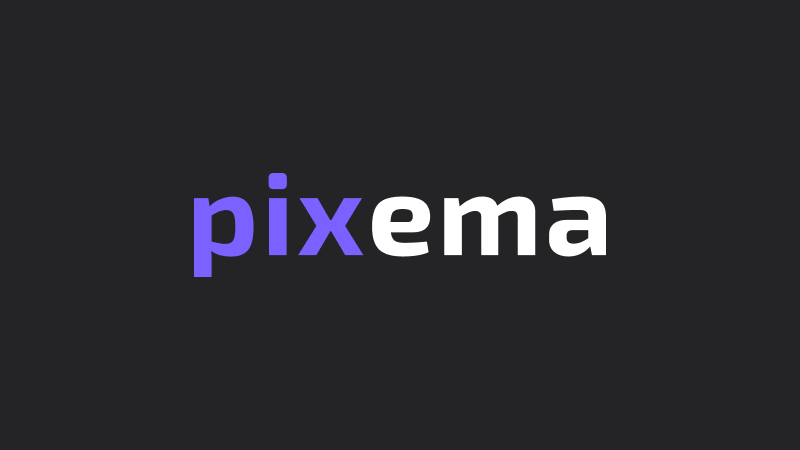
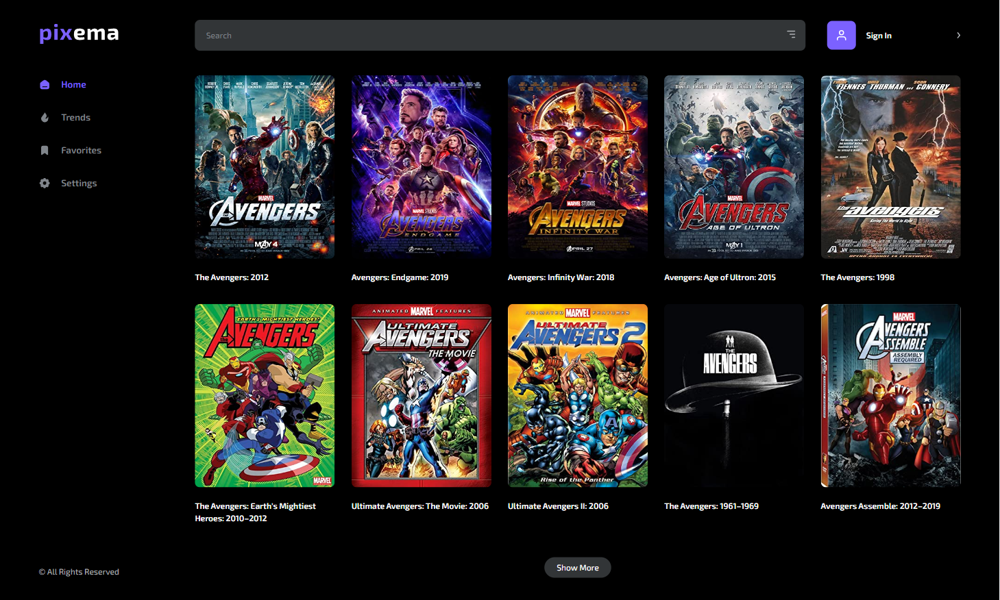
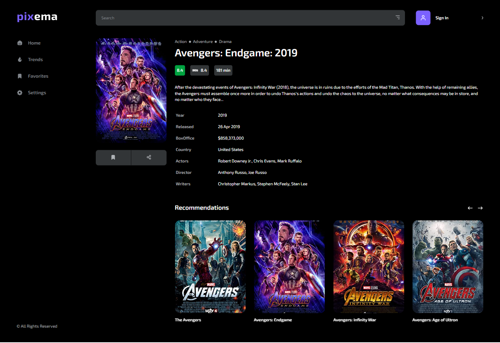
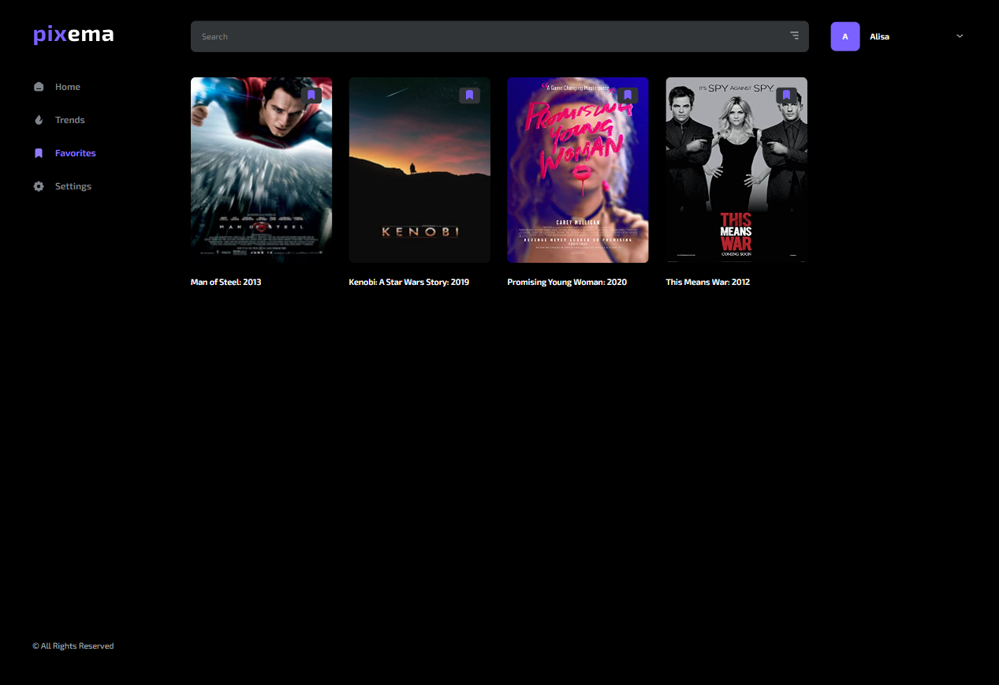
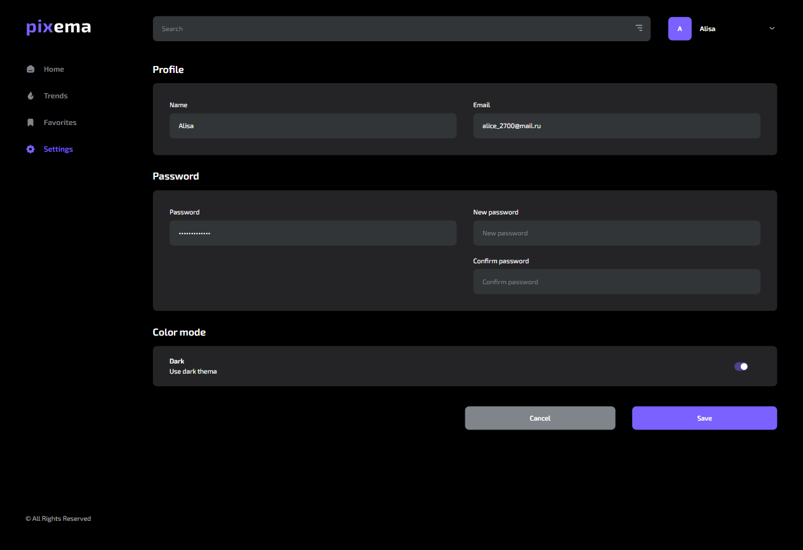
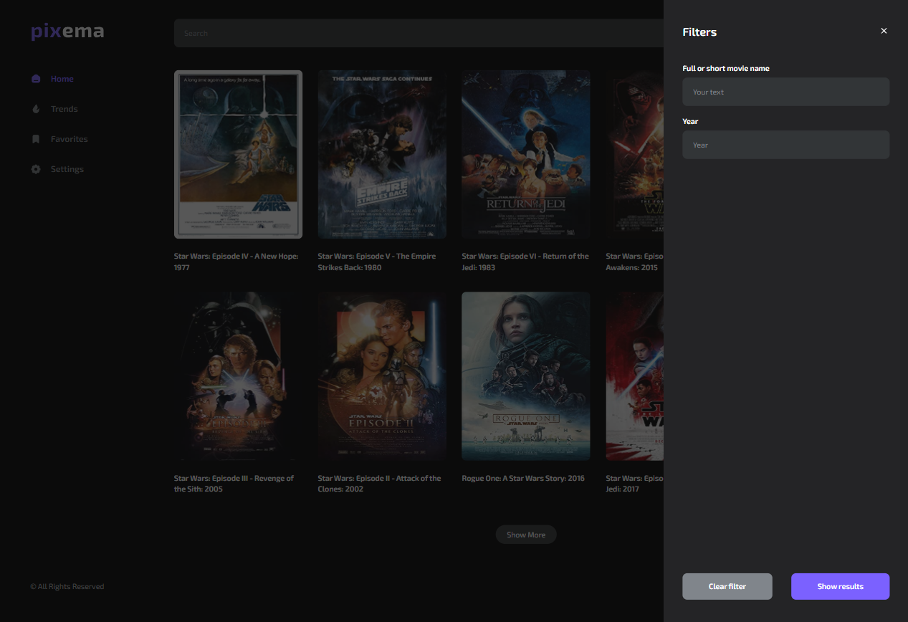

[![Contributors][contributors-shield]][contributors-url]
[![Forks][forks-shield]][forks-url]
[![Stargazers][stars-shield]][stars-url]
[![LinkedIn][linkedin-shield]][linkedin-url]

<br />
<div align="center">
  <a href="https://github.com/Alissse271/kinopoisk-clone">
    
  </a>

  <h3 align="center">Pixema</h3>

  <p align="center">
    New service for finding movies!
    <br />
    <br />
    You can click <a href="https://alissse271.github.io/kinopoisk-clone">here</a> and visit this site!
  </p>
</div>

<!-- TABLE OF CONTENTS -->
<details>
  <summary>Table of Contents</summary>
  <ol>
    <li>
      <a href="#about-the-project">About The Project</a>
      <ul>
        <li><a href="#built-with">Built With</a></li>
      </ul>
    </li>
    <li>
      <a href="#getting-started">Getting Started</a>
      <ul>
        <li><a href="#prerequisites">Prerequisites</a></li>
        <li><a href="#installation">Installation</a></li>
      </ul>
    </li>
    <li><a href="#usage">Usage</a></li>
    <li><a href="#contact">Contact</a></li>
  </ol>
</details>

<!-- ABOUT THE PROJECT -->

## About The Project

   

Pixema is a new modern movie search service!

Why Pixema is convenient?

- huge movie database for every taste;
- convenient search with filters;
- detailed information about each movie;
- page with trends;
- page with favorite movies for registered users
- the design theme change.

<p align="right">(<a href="#readme-top">back to top</a>)</p>

### Built With

- [![React][react.js]][react-url]
- [![React Router][reactrouter.com]][react-router-url]
- [![styled-components][styled-components]][styled-components-url]
- [![Redux Toolkit][redux-toolkit.js.org]][redux-url]
- [![React Hook Form][react-hook-form.com]][react-hook-form-url]
- [![Axios][axios-http.com]][axios-url]
- [![Firebase][firebase.google.com]][firebase-url]
- [![Framer Motion][framer.com]][framer-url]

<p align="right">(<a href="#readme-top">back to top</a>)</p>

<!-- GETTING STARTED -->

## Getting Started

To get started use the `npm start`.

### Prerequisites

To install all libraries use the `npm install`.

### Installation

If you want to use the local copy, follow these steps:

1. Get a free API Key at [![omdb-api][omdbapi.com]][omdb-api-url]
2. Clone the repo
   ```sh
   git clone https://github.com/Alissse271/kinopoisk-clone.git
   ```
3. Install NPM packages
   ```sh
   npm install
   ```
4. Enter your API in `.env`
   ```js
   REACT_APP_SERVICES_MOVIE_API_BASE_URL = "https://www.omdbapi.com/?apikey= ENTER YOUR API";
   ```

<p align="right">(<a href="#readme-top">back to top</a>)</p>

<!-- USAGE EXAMPLES -->

## Usage

After loading site you can see first 10 movies from OMDb API. You can press on the button `Show More` to load next 10 movies.



If you click on the movie card, you will see detailed information about selected film. On this page there are some similar movie recommendations. Registered users can add the movie to their favorites.



If you sign up, you can add any movies to your favorites and see all of them on favorites page.



Settings page provides an opportunity to change your name, email and password.
You can also set your favorite theme: light or dark.



If you open filters, you can search for movies by name and year of release.



Other features you can find out by testing it!

<p align="right">(<a href="#readme-top">back to top</a>)</p>

## Contact

Alisa Gusarova
Telegram: [@Alice_xv](telegram)
<br />
LinkedIn: [https://www.linkedin.com/in/alisa-gusarova/](linkedin)

Project Link: [https://github.com/Alissse271/kinopoisk-clone](https://github.com/Alissse271/kinopoisk-clone)

<p align="right">(<a href="#readme-top">back to top</a>)</p>

[contributors-shield]: https://img.shields.io/github/contributors/Alissse271/kinopoisk-clone.svg?style=for-the-badge
[contributors-url]: https://github.com/Alissse271/kinopoisk-clone/graphs/contributors
[forks-shield]: https://img.shields.io/github/forks/Alissse271/kinopoisk-clone.svg?style=for-the-badge
[forks-url]: https://github.com/Alissse271/kinopoisk-clone/network/members
[stars-shield]: https://img.shields.io/github/stars/Alissse271/kinopoisk-clone.svg?style=for-the-badge
[stars-url]: https://github.com/Alissse271/kinopoisk-clone/stargazers
[linkedin-shield]: https://img.shields.io/badge/-LinkedIn-black.svg?style=for-the-badge&logo=linkedin&colorB=555
[linkedin-url]: https://www.linkedin.com/in/alisa-gusarova/
[typescriptlang.org]: https://img.shields.io/badge/-Typescript-blue?style=for-the-badge&logo=typescript&logoColor=white
[typescript-url]: https://www.typescriptlang.org/
[react.js]: https://img.shields.io/badge/React-20232A?style=for-the-badge&logo=react&logoColor=61DAFB
[react-url]: https://reactjs.org/
[axios-http.com]: https://img.shields.io/badge/-axios-671ddf?style=for-the-badge&logo=axios&logoColor=white
[axios-url]: https://axios-http.com/ru/docs/intro
[firebase.google.com]: https://img.shields.io/badge/-firebase-5f6368?style=for-the-badge&logo=firebase&logoColor=orange
[firebase-url]: https://firebase.google.com/docs/
[redux-toolkit.js.org]: https://img.shields.io/badge/-redux--toolkit-764abc?style=for-the-badge&logo=redux&logoColor=white
[redux-url]: https://redux-toolkit.js.org/
[react-hook-form.com]: https://img.shields.io/badge/-react--hook--form-1e2a4a?style=for-the-badge&logo=react-hook-form&logoColor=ec5990
[react-hook-form-url]: https://react-hook-form.com/
[framer.com]: https://img.shields.io/badge/-framer--motion-DD0031?style=for-the-badge&logo=framer&logoColor=black
[framer-url]: https://www.framer.com/
[reactrouter.com]: https://img.shields.io/badge/React_Router-CA4245?style=for-the-badge&logo=react-router&logoColor=white
[react-router-url]: https://reactrouter.com/
[styled-components]: https://img.shields.io/badge/styled--components-DB7093?style=for-the-badge&logo=styled-components&logoColor=white
[styled-components-url]: https://styled-components.com/
[omdbapi.com]: https://img.shields.io/badge/-OMDb%20API%20-blue
[omdb-api-url]: http://www.omdbapi.com/
